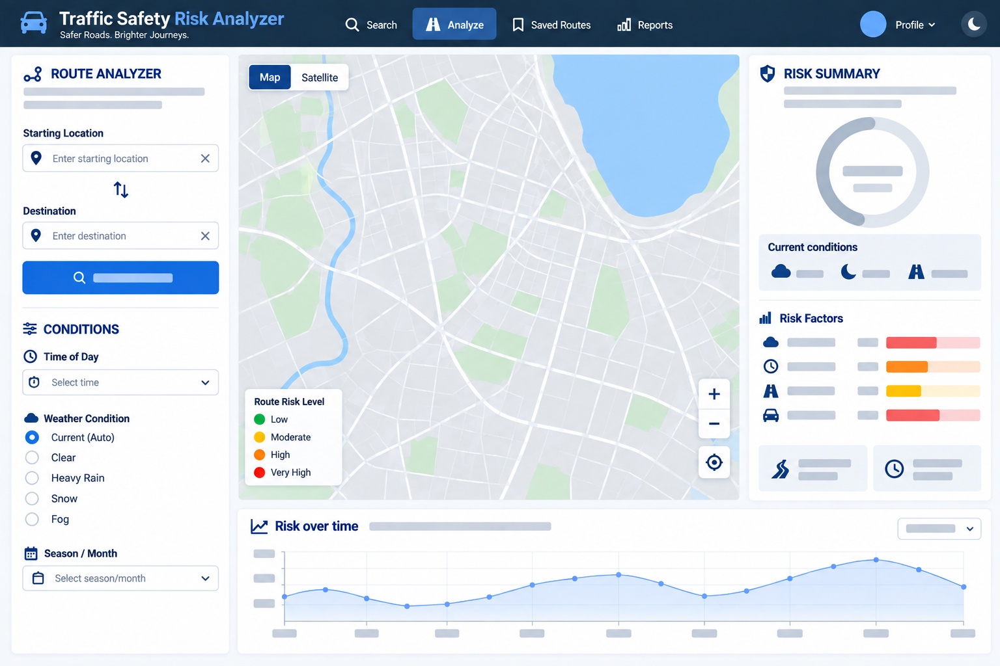

# Traffic Safety Risk Analyzer

**Team:** ReSQL
**Members:** Praveen Ramesh Jayasree, Adithyaa Veerabathiran Seran, Sree Vinay Ravuru, Saravanan Rajendran

## 1. Project Title

Traffic Safety Risk Analyzer

## 2. Project Summary

A significant portion of road accidents occur each year under circumstances that were predictable in retrospect. An on-ramp experiences an increase in collisions during snowfall, a rural roadway becomes hazardous after dark, and an intersection becomes unsafe during periods of heavy rain. The location, severity, and contributing variables of an incident are all documented in federal crash databases. However, since those are found in different datasets, they do not relate that to the current weather and road conditions. Drivers, city planners, and insurers find it challenging to respond to a straightforward query: which roads are truly dangerous, and under what circumstances?

By combining historical collision records with meteorological data for the same time and location, Traffic Safety Risk Analyzer closes that gap and reveals patterns that are not obvious in either dataset alone. Our method is designed to detect situations where a route may be disproportionately dangerous, such as in the rain, after dark, or during the cold. In order to determine why a location is dangerous rather than merely the number of collisions that have occurred there, the program allows users to search a location, route, or region and view its crash history broken down by weather condition, time of day, and road type along with a computed risk score.

## 3. Creative Component

A safest-route recommender is our innovative component. The tool suggests a route given a start point (A) and a destination (B) in the same manner as a mapping software, but it takes into account our calculated risk score for road segments along each prospective route, weighted against current or historical circumstances, rather than just optimizing for travel time. Instead of choosing the quickest option regardless of danger, the outcome is a path that strikes a balance between speed and safety.

Implementing this safest-route recommender requires computing and comparing risk across several candidate routes, presenting the trade-off between 'fastest' and 'safest' to the user, and integrating routing logic with our custom risk-scoring model.

## 4. Usefulness

- Provides the safest and shortest paths for travel from point A to point B.
  - Increases the safety of all travelers.
  - Offers drive-mode assistance for safe driving, similar to Google Maps.
  - Allows users to set favorite locations, such as home, work, and other frequently traveled destinations.
  - Visualizes historical crash data.
- Detects and monitors potential accident hotspots.
  - Identifies seasonal hotspots, providing data that can help city planners and drivers reduce accidents.

## 5. Realness: Data Sources

We combine crash records from the National Highway Traffic Safety Administration (NHTSA) with weather records from NOAA. Crash data tells us where and how people crashed, and weather data tells us what conditions were like. Joining them lets us see which places become dangerous under specific conditions.

### Crash data: NHTSA FARS (Fatality Analysis Reporting System)

FARS covers every fatal crash on US public roads, and it is official government data published every year. It gives the exact latitude and longitude of each crash, along with the date and time, the weather and light conditions reported by police, and the type of road.

| File | Rows (cardinality) | Columns (degree) | What one row represents |
|---|---|---|---|
| accident.csv | 36,297 | 80 | One fatal crash |
| vehicle.csv | 56,011 | 201 | One vehicle involved in a crash |
| person.csv | 88,326 | 126 | One person involved in a crash |

### Crash data: NHTSA CRSS (Crash Report Sampling System)

CRSS covers crashes of every severity, not just fatal ones, which gives us a full picture of how weather and lighting affect crash risk.

| File | Rows (cardinality) | Columns (degree) |
|---|---|---|
| accident.csv | 51,658 | 80 |
| vehicle.csv | 90,641 | 167 |
| person.csv | 126,159 | 112 |

### Weather data: NOAA GHCN-Daily (Global Historical Climatology Network, Daily)

GHCN-Daily provides daily precipitation, snowfall, snow depth, temperature and wind readings from thousands of US weather stations. The data is available in downloadable .txt files.

### How we map crashes and weather to a location

- **Crash location:** taken directly from the latitude and longitude in FARS. The few crashes with unknown coordinates are dropped.
- **Weather location:** taken from the coordinates of each weather station in the GHCN station list.
- **Linking the two:** for each crash, we find the closest weather station and pull that station's readings for the crash date. This attaches the day's rain, snow and temperature to every crash.

Because the weather readings are daily, they show whether it rained that day, not at the exact moment of the crash. We keep the weather recorded by police in FARS alongside the station data so the two can be used together.

## 6. Functionality

### 6.1 Functionality List

- Crash report verification/upvoting: Other users can confirm or flag a submitted crash report as accurate, giving reports a basic credibility signal instead of trusting every submission equally.
- Route history: The system saves each route a user searches (start, end, chosen route, timestamp), so they can revisit past searches instead of re-entering them.
- Edit/delete saved locations and reports: Users can update or remove their previously saved routes and submitted crash reports.
- Risk score subscriptions/alerts: A user picks a saved location or route and gets flagged if its risk score changes significantly (e.g., a spike in recent crash reports).
- Comparison view: Let a user compare risk scores across two or more locations/routes side by side, rather than one at a time.
- Admin/moderation view: An admin role that can review and remove inaccurate or spam crash reports.

### 6.2 Low-Fidelity UI Mockup

### 6.3 Project Work Distribution

| Member | Responsibility |
|---|---|
| Praveen Ramesh Jayasree | Database and data ingestion. Sourcing and cleaning NHTSA crash data and GHCN-Daily weather data, writing the join logic that matches each crash to the nearest weather station and date, designing the schema, and populating the database. |
| Adithyaa Veerabathiran Seran | Search & Lookup feature, end to end. Backend query logic for filtering by location, weather condition, time of day, and road type, plus the frontend search interface and results view. |
| Sree Vinay Ravuru | CRUD & Records feature, end to end. Saved locations, crash reports, and user accounts and preferences, including both backend endpoints and frontend forms and management views. |
| Saravanan Rajendran | Creative component. The safest-route recommender, including risk-score integration into route candidate comparison and the frontend presentation of route options. |

