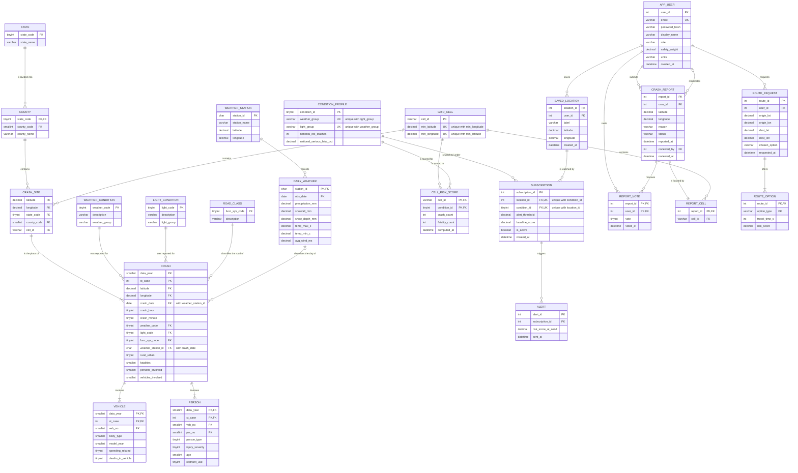

# Stage 2: Conceptual and Logical Database Design

**Project:** Traffic Safety Risk Analyzer
**Team:** ReSQL
**Members:** Praveen Ramesh Jayasree, Adithyaa Veerabathiran Seran, Sree Vinay Ravuru, Saravanan Rajendran

We chose an **Entity-Relationship Diagram (ERD)** in crow's foot notation for this stage. No UML diagram is included.

The design has **23 entities** and **25 relationships**, covering 1-1, 1-many and many-many types, with exactly one entity holding user account information.

---

## 1. ER Diagram

Mermaid cannot draw a unique constraint that spans two columns, so composite unique keys are marked `UK` on each column with a comment naming the partner column. Section 6.2 lists them as single constraints.



---

## 2. Entity Assumptions

Our data comes from three federal sources. NHTSA's FARS gives every fatal crash with exact coordinates, NHTSA's CRSS gives a weighted national sample of crashes of every severity but no coordinates, and NOAA's GHCN-Daily gives weather readings by station. None of them knows about the others, so part of this design exists to link them, and the rest supports what users do in the application.

**Years of data.** The database holds several FARS release years side by side, which is what makes seasonal and year-over-year hotspot analysis possible. Every crash, vehicle and person row carries its `data_year`. Only FARS crashes are loaded as `CRASH` rows. CRSS is used only offline, to compute the national figures stored in `CONDITION_PROFILE`, so CRSS case numbers never enter the database and cannot collide with FARS ones.

### 2.1 Reference entities from the crash data

FARS ships as flat CSV files where each crash row repeats the text description of its own weather, lighting, road type, state and county. We pulled those into their own entities so a description is stored once.

**STATE.** One row per US state, identified by the numeric code FARS uses. It is an entity rather than a text attribute because the state name would otherwise repeat across tens of thousands of rows, and because a county cannot be identified without knowing its state.

**COUNTY.** One row per county. County codes are only unique inside a state, so the key is the pair (state code, county code). The county name is determined by that pair rather than by any individual crash, which is what makes it an entity. We assume state and county codes mean the same place in every loaded year; if a release redefines a county, the loader must map it before insertion.

**WEATHER_CONDITION.** The weather the attending officer recorded: clear, rain, snow, fog and so on. Each code carries a `weather_group` that collapses roughly a dozen official codes into four working groups (dry, wet, snow or ice, low visibility), because risk scores need enough crashes per group to mean anything. Codes for "not reported" and "unknown" go into a fifth group, `unknown`. Keeping this as an entity means regrouping later is a change to a few rows, not to every crash.

**LIGHT_CONDITION.** The lighting at the time of the crash: daylight, dark but lighted, dark and unlit. Its `light_group` reduces these to day and dark, plus `unknown` for unreported codes. Our CRSS analysis showed that dark unlit roads produce serious or fatal outcomes roughly twice as often as daylight, so lighting is a first-class dimension of risk rather than a detail of the crash.

**ROAD_CLASS.** The functional class of the road, such as interstate, arterial or local. A separate entity because the same handful of classes describes every crash.

### 2.2 Location entities

**CRASH_SITE.** One row per distinct coordinate pair where a crash occurred, keyed by (latitude, longitude) at the full precision FARS publishes. It holds what the ground itself determines: the state and county containing the point and the grid cell it falls in.

This entity exists for a normalization reason explained in section 4. A coordinate pair determines which county contains it, and a county is not a property of a crash so much as of the ground it happened on. If those attributes sat on `CRASH`, the schema would carry a dependency whose determinant is not a key. It also matches how the application works: the risk shown for a place is a property of the place, and every crash there shares it. Attributes that can differ between two crashes at the same point, such as the matched weather station and the rural or urban code, stay on `CRASH` (section 4.1).

**GRID_CELL.** A square patch of map 0.1 degrees on each side, identified by its lower left corner. Individual points are too specific to score, since two crashes rarely share exact coordinates, so the map is divided into cells and the cells are scored. The size is a fixed design constant, not a per-row value, so every cell has the same size and a point falls in exactly one cell. The grid is equal in degrees, not in area: a cell is about 11 km north to south everywhere, but its east-west width shrinks with latitude, from about 10 km in southern Texas to about 6 km in Alaska. Scores compare cells at similar latitudes, so we accept this. It is an entity because crash sites, user reports and risk scores all refer to the same patches.

A point's cell is computed with exact decimal arithmetic, never floating point:

```
cell_id       = CONCAT(FLOOR(latitude * 10), '_', FLOOR(longitude * 10))
min_latitude  = FLOOR(latitude * 10) / 10
min_longitude = FLOOR(longitude * 10) / 10
```

For example, (40.1106, -88.2073) gives `cell_id` `401_-883`, the cell whose lower left corner is (40.1, -88.3). `FLOOR` rounds toward negative infinity, so the formula is correct for the negative longitudes of the whole United States. The application creates a `GRID_CELL` row the first time a crash site or report lands in a new cell.

**WEATHER_STATION.** One row per NOAA station, with its identifier, name and coordinates. The coordinates are the only reason weather can be connected to crashes at all, so the station must be an entity in its own right. We deliberately do not store the station's state or elevation, since both are determined by its coordinates, which are not a key here: 361 coordinate pairs in the NOAA station file are shared by more than one station.

### 2.3 Crash entities

**CRASH.** The central entity. One row is one fatal crash from FARS. NHTSA's case number `ST_CASE` is unique only within a release year, so the key is (data_year, st_case). It holds what varies between crashes at the same place: date, hour and minute, the reported weather, lighting and road class, the rural or urban code FARS records for the crash, the weather station matched to it (section 2.4), and the counts of fatalities, people and vehicles. Its location is a foreign key to `CRASH_SITE`.

**VEHICLE.** One row per vehicle involved in a crash. A vehicle cannot exist without its crash, and FARS numbers vehicles only within a case, so the key is (data_year, st_case, veh_no). This is a weak entity depending on `CRASH`. It is separate from `CRASH` because the number of vehicles varies, and inline columns would mean repeating groups.

**PERSON.** One row per person involved, carrying injury severity, age, person type and restraint use, keyed by (data_year, st_case, veh_no, per_no). FARS numbers people within a vehicle, so `veh_no` is part of the key. FARS also uses `veh_no = 0` for non-motorists such as pedestrians and cyclists, who belong to no vehicle. Because vehicle 0 never exists in `VEHICLE`, `PERSON` cannot carry a foreign key to `VEHICLE`, and making `veh_no` nullable is not an option because it is part of the primary key. `PERSON` therefore depends on `CRASH`, and the rule that a nonzero `veh_no` must name an existing vehicle of the same crash is enforced by a trigger (section 6.3). The diagram draws no PERSON to VEHICLE line for the same reason: no foreign key backs it.

### 2.4 Weather entity

**DAILY_WEATHER.** One row per station per day, holding precipitation, snowfall, snow depth, maximum and minimum temperature and average wind. NOAA's raw file is in long format with one row per single measurement, which would force a separate lookup for every value, so we reshape it. The key is (station, date), and it is a weak entity: a reading cannot exist without the station that made it.

The loader applies three rules, because GHCN-Daily is not clean data:

- **Units.** GHCN stores precipitation in tenths of a millimetre, temperatures in tenths of a degree and wind in tenths of a metre per second. These are converted to the units in the column names.
- **Missing values.** GHCN marks a missing value with the sentinel `-9999`. It is stored as NULL, never as a number.
- **Quality flags.** Every GHCN value carries a quality flag. A value whose flag is not blank failed one of NOAA's checks and is stored as NULL. A station-day row is kept if at least one measurement survives.

**Matching a crash to a station.** For each crash, the loader picks the nearest station within 50 km that has a non-null precipitation reading on the crash date, and stores it in `CRASH.weather_station_id`. If no station qualifies, the match is NULL. The crash still counts in every crash total and is left out only of analyses that need measured weather. Because the match depends on which stations reported on a given day, it is made per crash, not per site. Two crashes at one site on different days may use different stations. The loader reports the share of crashes that found a match.

### 2.5 Scoring entities

**CONDITION_PROFILE.** One row per combination of a known weather group and a known light group, for example "wet and dark". Four weather groups times two light groups gives exactly eight rows. `unknown` is a group on `WEATHER_CONDITION` and `LIGHT_CONDITION`, but it has no profile. A crash with unknown weather or lighting still counts in all crash totals, but it is not attributed to any condition, because assigning it one would be a guess. The profile also carries the national baseline figures computed from CRSS, using CRSS sampling weights over the same years as the loaded FARS data: the estimated number of crashes and the share that were serious or fatal in that condition. This is what makes CRSS useful to us. CRSS records no coordinates so it cannot be mapped, but it can say how dangerous a condition is nationally, which stabilises scores for cells with very few recorded crashes.

**CELL_RISK_SCORE.** The output of our scoring job: for one cell under one condition profile, the number of FARS crashes and fatalities recorded there across all loaded years, and when the figures were computed. It is a separate entity because a cell does not have one risk level. A road may be quiet in dry daylight and dangerous in wet darkness, and making that difference visible is the point of the project. The risk score itself is not stored here, for the reason given in section 4.3. It is computed by the `CellRiskCurrent` view, which also adds recent user reports.

### 2.6 Application entities

**APP_USER.** The only entity holding account information, as required. It stores email, password hash, display name, creation time, a `role` of either user or admin, and the user's two preferences: `safety_weight`, which controls how strongly the route recommender favours safety over speed, and `units`. Preferences and role are attributes rather than separate entities, both to respect the one-user-entity rule and because each user has exactly one of each. The role drives the moderation feature from our proposal: only an admin may change another user's report status.

**SAVED_LOCATION.** A place a user saved, such as home or work, with a label and coordinates. It is an entity rather than columns on `APP_USER` because one user saves many locations and we cannot know how many in advance. It does not store a `cell_id`, since the cell is determined by the coordinates and storing it here would create a non-key dependency, the same problem section 4.3 removes for crashes. When the alert job needs a location's cell, it applies the grid formula from section 2.2. Reports are different: their cell is stored in `REPORT_CELL`, because the risk view counts reports per cell across the whole table, which needs an indexed `cell_id` column. Saved locations are only ever looked up from location to cell, which the formula does without any index.

**CRASH_REPORT.** A hazard or crash reported by a user, with coordinates, a free-text reason, a status and a timestamp. These are records the application creates itself, as opposed to the historical federal data, and they let the risk picture reflect events after the last FARS release. The status is `active` when submitted, `resolved` when the hazard has cleared, and `removed` when an admin judges the report false or spam. The moderation fields `reviewed_by` and `reviewed_at` record which admin last acted on the report and when, and stay empty until someone does. We keep them on the report rather than in a separate moderation log because only the latest decision matters for whether a report counts toward risk.

Two different actions remove a report. An author who deletes their own report deletes the row, and its votes and cell placement go with it. An admin who rejects a report sets `status = 'removed'` and keeps the row, so the moderation record survives.

**Which reports count toward risk.** A report counts if its status is not `removed`, it was reported in the last 30 days, and it has at least as many confirming votes as flags. A new report with no votes counts, so a burst of fresh reports is visible immediately. Resolved reports still count, because the crash or hazard did happen.

**REPORT_CELL.** Which grid cell a user report falls in. It mirrors the role `CRASH_SITE` plays for crashes: the cell is computed by us from the coordinates, not supplied by the reporter, so it is kept out of `CRASH_REPORT`.

**REPORT_VOTE.** One user's vote on one report, used to confirm or flag it. It is the associative entity resolving the many-many relationship between users and reports, and it carries its own attributes: the vote value and when it was cast.

**ROUTE_REQUEST.** One route search by one user, storing origin, destination, the timestamp, and which option the user chose. `chosen_option` is empty until the user picks one, and stays empty if they never do. It supports route history.

**ROUTE_OPTION.** One alternative the recommender offered for a request: the fastest, the safest, or a balance of the two, with its travel time and the risk score shown for it. It is a weak entity keyed by (route_id, option_type), since an option has no meaning outside its request. Storing every option, not just the chosen one, is what lets us compare what users were offered against what they picked, and lets route history show the trade-off again. The stored score and travel time are snapshots of what was displayed, not values recomputed later. The route geometry itself comes from an external routing service and is not stored, so the cells a route passed through are not kept. The snapshot score is the record of what that route was worth at the time.

**SUBSCRIPTION.** A standing request to be alerted when a saved location's risk changes significantly under one condition profile, such as "wet and dark". Risk in this project is never a single number for a place, it is a number for a place under a condition, so a subscription has to say which condition it watches; `condition_id` is that choice. The entity holds the threshold that counts as a significant change, the risk score at the moment of subscribing (`baseline_score`), whether it is active, and when it was created. `baseline_score` is written once, when the subscription is created, and never updated.

It is an entity rather than a flag on `SAVED_LOCATION` because one saved place can be watched under several conditions. A given location can be watched only once per condition, so (location_id, condition_id) is declared unique. It deliberately has no `user_id`: the owner is reached through the saved location, and storing it again would create a dependency from `location_id` to `user_id` inside this relation.

**Scope.** Our proposal said a user could subscribe to "a saved location or route". We are limiting subscriptions to saved locations for this project. A route in our design is a one-off search stored in `ROUTE_REQUEST`, not a standing object the user maintains, and its risk depends on which alternative the routing service returns on a given day, so there is no fixed set of cells to watch. Route subscriptions are out of scope.

**How a significant change is detected.** A scheduled job, for each active subscription, computes the location's cell, reads the current score for that cell and condition from the `CellRiskCurrent` view, and compares it against the last score the user was told about. That previous score is the `risk_score_at_send` of the most recent `ALERT` for the subscription, or `baseline_score` if no alert has been sent yet. If the absolute difference is at least `alert_threshold`, the job inserts a new `ALERT`, so both rises and drops are reported. Because each comparison is against the last score sent, a score that settles at a new level alerts once, not on every run. Because the view includes recent user reports, a spike in reports near a saved location can trigger an alert between scoring runs, which is the case our proposal described. We chose this over a mutable `last_score` column on `SUBSCRIPTION` because the alert history already records every value sent, so a second copy would be redundant and could drift out of sync.

**ALERT.** One notification actually sent for a subscription, with the risk score at the time and the timestamp. Its latest row for a subscription is also the reference point for detecting the next change, as described above. It is separate from `SUBSCRIPTION` because a subscription can fire repeatedly, and because we need a record of what was sent when a user asks why they were notified. Keeping a "last notified" column on the subscription instead would lose that history.

---

## 3. Relationships and Cardinality

| # | Relationship | Cardinality | Assumption |
|---|---|---|---|
| 1 | STATE is divided into COUNTY | 1 to many | A county belongs to exactly one state and a state has many counties. County codes repeat across states, so a county is identified only together with its state. |
| 2 | COUNTY contains CRASH_SITE | 1 to many | A coordinate pair lies in exactly one county, and a county contains many crash sites. Verified on the 2024 data: no coordinate pair maps to more than one county. State is reached through the composite foreign key to COUNTY, so no separate link to STATE is needed. |
| 3 | CRASH_SITE is the place of CRASH | 1 to many, total on both sides | A crash happens at exactly one site. A site usually has one crash but can have several: 15 coordinate pairs in 2024 alone carry two crashes each, and more repeat once several years are loaded. A site always has at least one crash, since sites are created only from crash records. |
| 4 | WEATHER_CONDITION was reported for CRASH | 1 to many | A crash report lists one officer-recorded weather condition. FARS includes codes for unknown and not reported, so the value is never empty. Many crashes share a condition. |
| 5 | LIGHT_CONDITION was reported for CRASH | 1 to many | One lighting condition per crash, for the same reason. |
| 6 | ROAD_CLASS classifies the road of CRASH | 1 to many | A crash is assigned one functional class. This stays on the crash rather than the site because two coordinate pairs in the 2024 data carry different road classes, so the site does not determine it. |
| 7 | CRASH involves VEHICLE | 1 to many, total on both sides | A fatal crash involves at least one vehicle, and a vehicle record cannot exist without its crash. |
| 8 | CRASH involves PERSON | 1 to many, total on both sides | Every fatal crash involves at least one person, since by definition someone died. A person record belongs to exactly one crash. Pedestrians and cyclists attach to the crash with vehicle number 0. |
| 9 | GRID_CELL contains CRASH_SITE | 1 to many | A site falls in exactly one cell, since cells all have the same size and tile the map without overlapping. A cell holds many sites, or none. |
| 10 | DAILY_WEATHER describes the day of CRASH | Zero or one reading per crash, zero or many crashes per reading | A crash is linked to the reading of its matched station on its crash date, through the composite foreign key (weather_station_id, crash_date). The link is empty when no station within 50 km reported that day (section 2.4). One reading can describe many crashes near that station on the same day. In 2024 the nearest station was a median 5.35 km from a crash, and 10,475 stations were nearest to at least one crash. |
| 11 | WEATHER_STATION records DAILY_WEATHER | 1 to many, total on the weather side | A station reports many daily readings. A reading cannot exist without its station, and a station may have gaps on days it reported nothing. |
| 12 | GRID_CELL is scored in CELL_RISK_SCORE | 1 to many | A cell has one row per condition profile, so up to eight rows. Cells with no crash history have none. |
| 13 | CONDITION_PROFILE is scored for CELL_RISK_SCORE | 1 to many | Each score row refers to exactly one profile, and a profile is used by many cells. With relationship 12, this makes CELL_RISK_SCORE the associative entity of a **many-many** relationship between grid cells and condition profiles. |
| 14 | APP_USER saves SAVED_LOCATION | 1 to many | A saved location belongs to one user, and users may save none. Locations are not shared between accounts. |
| 15 | APP_USER submits CRASH_REPORT | 1 to many | A report has exactly one author, so only that user, or an admin, may edit or delete it. |
| 16 | APP_USER casts REPORT_VOTE | 1 to many | A user may vote on many reports but only once on each, which the composite key enforces. |
| 17 | CRASH_REPORT receives REPORT_VOTE | 1 to many | A report may collect many votes or none. With relationship 16, this makes REPORT_VOTE the associative entity of a **many-many** relationship between users and reports. |
| 18 | CRASH_REPORT is located by REPORT_CELL | 1 to 1 | Each report is placed in exactly one cell, computed from its coordinates, and a placement row describes exactly one report. |
| 19 | GRID_CELL contains REPORT_CELL | 1 to many | A cell may hold many user reports or none. |
| 20 | APP_USER requests ROUTE_REQUEST | 1 to many | A route search belongs to one user. Users may make many searches or none. |
| 21 | APP_USER moderates CRASH_REPORT | Zero or one reviewer per report, zero or many reports per admin | A report is reviewed by at most one admin, recorded in `reviewed_by`, and most reports are never reviewed. An admin may review many reports. This is a second, separate relationship between the same two entities: relationship 15 records who wrote the report, this one records who last acted on it. |
| 22 | SAVED_LOCATION is watched by SUBSCRIPTION | 1 to many | A subscription watches exactly one saved location, and a location may have several subscriptions, one per condition, or none. Deleting the location deletes its subscriptions. |
| 23 | CONDITION_PROFILE is watched under SUBSCRIPTION | 1 to many | Each subscription names exactly one condition profile to watch, so a user can be alerted about wet-and-dark risk without being alerted about dry daylight. A profile may be watched by many subscriptions. Combined with relationship 22 and the unique pair (location_id, condition_id), a location and a profile are linked at most once. |
| 24 | SUBSCRIPTION triggers ALERT | 1 to many | A subscription may send many alerts over time, or none. An alert always belongs to exactly one subscription. |
| 25 | ROUTE_REQUEST offers ROUTE_OPTION | 1 to many, total on both sides | Every request produces at least one option and at most three (fastest, safest, balanced). When the fastest and safest routes coincide, fewer options are stored. An option belongs to exactly one request. |

**Relationship types present:** 1-1 (relationship 18), 1-many (the majority), and many-many resolved through associative entities (grid cell to condition profile via `CELL_RISK_SCORE`, user to crash report via `REPORT_VOTE`). Relationships 15 and 21 show that two entities can be linked more than once, for different reasons.

---

## 4. Normalization

We normalized to **Boyce-Codd Normal Form (BCNF)**: for every non-trivial functional dependency X to Y, X must be a superkey of its relation.

### 4.1 The dependency set we declare

BCNF is only meaningful against a declared set of dependencies, and geographic data can always yield more of them, so we state our rule explicitly.

- **Declared.** A coordinate pair determines the fixed boundaries that contain it: state, county and grid cell. These are administrative and geometric facts that do not change with time or observer, given the assumption in section 2.1 that county codes are stable across loaded years.
- **Declared.** A grid cell's identifier and its lower left corner determine each other (section 2.2).
- **Not declared.** Weather, lighting, road class and the rural or urban code are what was recorded for the crash, not values derived from geography. Two reports of the same place may legitimately differ. The 2024 data shows this for road class: two coordinate pairs carry different road classes. Rural and urban boundaries are also redrawn after each census, so the code can differ between years at the same point.
- **Not declared.** The matched weather station. It is the result of a matching step over external data: which stations reported on that day and passed NOAA's quality checks, within a distance cap. That data can be revised, so the match is recorded per crash as provenance, not derived from the other columns of the row.
- **Not declared.** Logged snapshots such as `RouteOption.risk_score`, `RouteOption.travel_time_s`, `Subscription.baseline_score` and `Alert.risk_score_at_send`, which record what a user was shown at a moment in time and cannot be reconstructed from the other columns of that row.
- **Outside normal forms.** Stored counts that summarize child rows, such as `fatalities`, are cross-relation redundancy, not functional dependencies within a relation. Section 4.5 explains how we treat them.

### 4.2 The starting point

The raw data is far from normalized. A single FARS `accident.csv` row carries both `WEATHER` and `WEATHERNAME`, both `STATE` and `STATENAME`, and similar code and label pairs for county, lighting and road class, which is a textbook transitive dependency: the case number determines the code, and the code determines the label. NOAA's file has the opposite problem, storing one row per single measurement, so a station's rainfall and temperature for one day sit in different rows.

Our design fixes both. Every code and label pair became a reference relation, and the long weather file was pivoted so a station-day is one row.

### 4.3 The decompositions we performed

**Crash location.** A first draft kept `state_code`, `county_code`, `cell_id`, a nearest `station_id`, `station_distance_km` and `rural_urban` on `CRASH`. That relation then held (latitude, longitude) to (state_code, county_code, cell_id), whose determinant is not a superkey, since coordinates do not identify a crash. We decomposed into:

- `Crash(data_year, st_case, latitude, longitude, crash_date, ...)`, with only (data_year, st_case) as a determinant.
- `CrashSite(latitude, longitude, state_code, county_code, cell_id)`, where the determinant is the key.

The decomposition is lossless because the two relations share (latitude, longitude), which is a key of `CrashSite`. It removes little storage, since only 15 coordinate pairs in 2024 carry more than one crash, but normalization targets the constraint, not the observed duplication.

The station match and `rural_urban` stay on `Crash`, because neither is determined by the coordinates (section 4.1). `station_distance_km` was dropped. The distance is fixed by the crash's coordinates and the station's coordinates, so inside `Crash` the dependency (latitude, longitude, weather_station_id) to station_distance_km would hold with a determinant that is not a superkey. The distance is computed from the two coordinate pairs whenever it is needed.

**User reports.** The same argument applies to reports, giving `CrashReport` and `ReportCell`.

**Weather station attributes.** An earlier draft stored the station's state and elevation. Both are determined by the station's coordinates, and coordinates are not a key of `WeatherStation`, since 361 coordinate pairs in the NOAA file are shared by more than one station. Neither attribute is used by the application, so both were dropped.

**Grid cell size.** An earlier draft stored `cell_size_deg` on every cell, as if cells could differ in size, while the cell formula assumed 0.1 degrees. With one size for the whole grid the column held the same value in every row, and a point could not be guaranteed to fall in exactly one cell. We made the size a design constant and removed the column.

**Subscription ownership.** A first draft gave `Subscription` both a `user_id` and a `location_id`. Because a saved location belongs to exactly one user, that relation held location_id to user_id, a determinant that is not a key, which is a transitive dependency and a BCNF violation. We removed `user_id`; the owner is found by joining through `SavedLocation`. The same reasoning kept `Alert` free of a user reference.

**Route options.** An earlier draft stored one `route_risk_score_at_request` and one `travel_time_s` on `RouteRequest`, for the chosen option only, which lost the alternatives the user was offered. Those values now live in `RouteOption`, one row per alternative, and `RouteRequest` keeps only which option was chosen.

**The risk score.** An earlier draft stored `risk_score` in `CellRiskScore`. Since the score is computed from the stored counts and the condition's national baseline, the dependency (crash_count, fatality_count, condition_id) to risk_score held, and that determinant is not a superkey, because `cell_id` is missing from it. We removed the column and expose the score as a view.

The score runs from 0 to 100. For a cell under one condition profile:

- **Historical rate.** FARS crashes per loaded year in that cell and condition, multiplied by how dangerous the condition is nationally: the profile's `national_serious_fatal_pct` divided by the average of that figure over all eight profiles.
- **Report term.** 0.5 for each user report that counts toward risk (section 2.6). Reports carry no weather or lighting, so they raise every condition of their cell equally.
- **Score.** `100 * (1 - EXP(-(historical rate + report term) / 2))`. The curve rises steeply for the first few crashes per year and flattens near 100, so busy urban cells do not dwarf everything else. The constants 0.5 and 2 are tuning parameters, to be calibrated in the implementation stage.

```sql
CREATE VIEW CellRiskCurrent AS
SELECT g.cell_id, p.condition_id,
       COALESCE(s.crash_count, 0)    AS crash_count,
       COALESCE(s.fatality_count, 0) AS fatality_count,
       COALESCE(r.recent_reports, 0) AS recent_reports,
       ROUND(100 * (1 - EXP(-(
             COALESCE(s.crash_count, 0) / y.years
               * p.national_serious_fatal_pct / b.avg_pct
           + 0.5 * COALESCE(r.recent_reports, 0)) / 2)), 2) AS risk_score
FROM GridCell g
CROSS JOIN ConditionProfile p
CROSS JOIN (SELECT COUNT(DISTINCT data_year) AS years FROM Crash) y
CROSS JOIN (SELECT AVG(national_serious_fatal_pct) AS avg_pct
            FROM ConditionProfile) b
LEFT JOIN CellRiskScore s
       ON s.cell_id = g.cell_id AND s.condition_id = p.condition_id
LEFT JOIN (SELECT rc.cell_id, COUNT(*) AS recent_reports
           FROM ReportCell rc
           JOIN CrashReport cr ON cr.report_id = rc.report_id
           WHERE cr.status <> 'removed'
             AND cr.reported_at >= NOW() - INTERVAL 30 DAY
             AND (SELECT COALESCE(SUM(v.vote), 0) FROM ReportVote v
                  WHERE v.report_id = cr.report_id) >= 0
           GROUP BY rc.cell_id) r
       ON r.cell_id = g.cell_id
WHERE s.cell_id IS NOT NULL OR r.cell_id IS NOT NULL;
```

The view returns only cells with crash history or recent reports. Every other cell has a score of 0.

We also considered storing a report count per cell. A count of reports in a cell depends on `cell_id` alone, which is half of `CellRiskScore`'s key, so it would be a partial dependency and break 2NF. Reports are counted inside the view instead, which also keeps them current between scoring runs.

### 4.4 Dependency check on the final schema

| Relation | Determinants | In BCNF? |
|---|---|---|
| State | state_code | Yes, the key. |
| County | (state_code, county_code) | Yes. County names repeat nationally, so the name determines nothing. |
| WeatherCondition | weather_code | Yes. |
| LightCondition | light_code | Yes. |
| RoadClass | func_sys_code | Yes. |
| CrashSite | (latitude, longitude) | Yes, the key, by the declared rule in 4.1. |
| Crash | (data_year, st_case) | Yes. Geography-determined attributes live in CrashSite, the derived station distance was dropped, and the station match and rural or urban code are recorded per crash (4.1). |
| Vehicle | (data_year, st_case, veh_no) | Yes. |
| Person | (data_year, st_case, veh_no, per_no) | Yes. |
| GridCell | cell_id; and (min_latitude, min_longitude) | Yes, both are candidate keys, since the cell id and the corner determine each other. |
| WeatherStation | station_id | Yes, after dropping state and elevation. |
| DailyWeather | (station_id, obs_date) | Yes. No measurement determines another. |
| ConditionProfile | condition_id; and (weather_group, light_group) | Yes, both are candidate keys, so the group pair is declared unique. |
| CellRiskScore | (cell_id, condition_id) | Yes, after removing the derived score and the per-cell report count. |
| AppUser | user_id; and email | Yes, both are candidate keys, since email is unique. |
| SavedLocation | location_id | Yes. Two users may save the same coordinates under different labels. |
| CrashReport | report_id | Yes. |
| ReportCell | report_id | Yes. |
| ReportVote | (report_id, user_id) | Yes. |
| RouteRequest | route_id | Yes. Two identical searches at different times are separate rows. |
| RouteOption | (route_id, option_type) | Yes. Score and travel time are snapshots of what was shown (4.1). |
| Subscription | subscription_id; and (location_id, condition_id) | Yes. Both are candidate keys, since a location can be watched only once per condition. The redundant user reference was removed. `baseline_score` is a snapshot taken at subscription time, not recomputable from the row. |
| Alert | alert_id | Yes. The score recorded is what was sent, not a recomputable value. |

### 4.5 Redundancy we keep deliberately

`Crash.fatalities` and `Vehicle.deaths_in_vehicle` duplicate counts obtainable from `Person`. We checked this on the 2024 data and both match exactly, across 36,297 crashes and 56,011 vehicles. They are not functional dependencies inside either relation, so they do not affect BCNF, and we keep them because every risk query needs fatality counts and recomputing them over 88,326 person rows per year of data per query is wasteful. The loader checks that they match for every year it loads.

`Crash.persons_involved` and `Crash.vehicles_involved` must be kept for a different reason: they are not derivable at all. They disagree with the child row counts for 8,454 and 1,070 crashes respectively in 2024, because FARS counts only motorists and only vehicles in transport, while the person and vehicle files also include non-motorists and parked vehicles. Deleting them would lose information.

`CellRiskScore.crash_count` and `fatality_count` are a materialized aggregate of `Crash`, grouped by cell (through `CrashSite`) and by condition profile (through the weather and light groups). Like the counts above, this is cross-relation redundancy, not a dependency inside the relation. We keep it because computing the aggregate over every crash on each map request is too slow. `computed_at` records when it was last rebuilt, and the scoring job rebuilds it whenever a year of FARS data is loaded.

Finally, we do not copy the weather of each crash onto the crash row. That would reintroduce the dependency (station_id, date) to the measurements, which already lives in `DailyWeather`, and would duplicate a day's rainfall across every crash near that station. Instead `Crash` carries the composite foreign key (weather_station_id, crash_date) into `DailyWeather`, which guarantees the reading exists, and the join uses `DailyWeather`'s primary key index.

---

## 5. Logical Design: Relational Schema

Types are MySQL types and match the diagram. Coordinates use different precisions by source: FARS publishes crash coordinates to 8 decimal places and they are stored exactly, so two distinct crash points are never merged by rounding. NOAA station coordinates have 4 decimal places. Coordinates entered in the application use 6 decimal places, about 0.1 m.

```
State(state_code:TINYINT [PK], state_name:VARCHAR(40))

County(state_code:TINYINT [PK] [FK to State.state_code], county_code:SMALLINT [PK],
       county_name:VARCHAR(60))

WeatherCondition(weather_code:TINYINT [PK], description:VARCHAR(60),
                 weather_group:VARCHAR(20))

LightCondition(light_code:TINYINT [PK], description:VARCHAR(60),
               light_group:VARCHAR(10))

RoadClass(func_sys_code:TINYINT [PK], description:VARCHAR(60))

GridCell(cell_id:VARCHAR(12) [PK], min_latitude:DECIMAL(4,1),
         min_longitude:DECIMAL(5,1))
         -- UNIQUE(min_latitude, min_longitude)

WeatherStation(station_id:CHAR(11) [PK], station_name:VARCHAR(40),
               latitude:DECIMAL(7,4), longitude:DECIMAL(8,4))

DailyWeather(station_id:CHAR(11) [PK] [FK to WeatherStation.station_id],
             obs_date:DATE [PK], precipitation_mm:DECIMAL(6,1),
             snowfall_mm:DECIMAL(6,1), snow_depth_mm:DECIMAL(6,1),
             temp_max_c:DECIMAL(4,1), temp_min_c:DECIMAL(4,1),
             avg_wind_ms:DECIMAL(4,1))

CrashSite(latitude:DECIMAL(10,8) [PK], longitude:DECIMAL(11,8) [PK],
          (state_code:TINYINT, county_code:SMALLINT)
              [FK to County(state_code, county_code)],
          cell_id:VARCHAR(12) [FK to GridCell.cell_id])

Crash(data_year:SMALLINT [PK], st_case:INT [PK],
      (latitude:DECIMAL(10,8), longitude:DECIMAL(11,8))
          [FK to CrashSite(latitude, longitude)],
      crash_date:DATE, crash_hour:TINYINT, crash_minute:TINYINT,
      weather_code:TINYINT [FK to WeatherCondition.weather_code],
      light_code:TINYINT [FK to LightCondition.light_code],
      func_sys_code:TINYINT [FK to RoadClass.func_sys_code],
      weather_station_id:CHAR(11),
      rural_urban:TINYINT,
      fatalities:SMALLINT, persons_involved:SMALLINT, vehicles_involved:SMALLINT)
      -- FK (weather_station_id, crash_date) to DailyWeather(station_id, obs_date)

Vehicle((data_year:SMALLINT, st_case:INT) [PK] [FK to Crash(data_year, st_case)],
        veh_no:SMALLINT [PK],
        body_type:SMALLINT, model_year:SMALLINT, speeding_related:TINYINT,
        deaths_in_vehicle:TINYINT)

Person((data_year:SMALLINT, st_case:INT) [PK] [FK to Crash(data_year, st_case)],
       veh_no:SMALLINT [PK], per_no:SMALLINT [PK],
       person_type:TINYINT, injury_severity:TINYINT, age:SMALLINT,
       restraint_use:TINYINT)

ConditionProfile(condition_id:TINYINT [PK], weather_group:VARCHAR(20),
                 light_group:VARCHAR(10), national_est_crashes:INT,
                 national_serious_fatal_pct:DECIMAL(5,2))
                 -- UNIQUE(weather_group, light_group)

CellRiskScore(cell_id:VARCHAR(12) [PK] [FK to GridCell.cell_id],
              condition_id:TINYINT [PK] [FK to ConditionProfile.condition_id],
              crash_count:INT, fatality_count:INT, computed_at:DATETIME)

AppUser(user_id:INT [PK], email:VARCHAR(120), password_hash:VARCHAR(255),
        display_name:VARCHAR(60), role:VARCHAR(10), safety_weight:DECIMAL(3,2),
        units:VARCHAR(10), created_at:DATETIME)
        -- UNIQUE(email)

SavedLocation(location_id:INT [PK], user_id:INT [FK to AppUser.user_id],
              label:VARCHAR(60), latitude:DECIMAL(9,6),
              longitude:DECIMAL(10,6), created_at:DATETIME)

CrashReport(report_id:INT [PK], user_id:INT [FK to AppUser.user_id],
            latitude:DECIMAL(9,6), longitude:DECIMAL(10,6),
            reason:VARCHAR(255), status:VARCHAR(20), reported_at:DATETIME,
            reviewed_by:INT [FK to AppUser.user_id], reviewed_at:DATETIME)

ReportCell(report_id:INT [PK] [FK to CrashReport.report_id],
           cell_id:VARCHAR(12) [FK to GridCell.cell_id])

ReportVote(report_id:INT [PK] [FK to CrashReport.report_id],
           user_id:INT [PK] [FK to AppUser.user_id],
           vote:TINYINT, voted_at:DATETIME)

RouteRequest(route_id:INT [PK], user_id:INT [FK to AppUser.user_id],
             origin_lat:DECIMAL(9,6), origin_lon:DECIMAL(10,6),
             dest_lat:DECIMAL(9,6), dest_lon:DECIMAL(10,6),
             chosen_option:VARCHAR(10), requested_at:DATETIME)

RouteOption(route_id:INT [PK] [FK to RouteRequest.route_id],
            option_type:VARCHAR(10) [PK],
            travel_time_s:INT, risk_score:DECIMAL(5,2))

Subscription(subscription_id:INT [PK],
             location_id:INT [FK to SavedLocation.location_id],
             condition_id:TINYINT [FK to ConditionProfile.condition_id],
             alert_threshold:DECIMAL(5,2), baseline_score:DECIMAL(5,2),
             is_active:BOOLEAN, created_at:DATETIME)
             -- UNIQUE(location_id, condition_id)

Alert(alert_id:INT [PK],
      subscription_id:INT [FK to Subscription.subscription_id],
      risk_score_at_send:DECIMAL(5,2), sent_at:DATETIME)
```

**Translation notes.**

- Each of the 23 entities became one relation.
- 1-many relationships became foreign keys on the many side: a crash carries its site coordinates plus its weather, light and road class codes; a crash site carries its county and cell; a saved location carries its user.
- A column group in parentheses, such as `(state_code, county_code)`, is one composite foreign key, declared as a single `FOREIGN KEY (...) REFERENCES ...(...)` constraint, never as separate single-column keys. This applies to `CrashSite` to `County`, `Crash` to `CrashSite`, `Vehicle` and `Person` to `Crash`, and `Crash` to `DailyWeather`.
- `Crash` to `DailyWeather` uses (weather_station_id, crash_date). `weather_station_id` is nullable, and under MySQL's default matching a composite foreign key with a NULL part is not checked, so a crash with no matched station is valid.
- The 1-1 relationship became a relation whose primary key is also its foreign key, which is why `ReportCell` is keyed by `report_id`.
- The two many-many relationships became `CellRiskScore` and `ReportVote`, each keyed by the pair of parent keys and carrying its own attributes.
- The weak entities `Vehicle`, `Person`, `DailyWeather` and `RouteOption` took composite keys of the parent key plus their own discriminator.
- `CrashReport` carries two foreign keys to `AppUser`, one for its author and one for the admin who reviewed it, which is how two distinct relationships between the same pair of entities are translated.
- `RouteRequest.chosen_option` is not a foreign key to `RouteOption`. Such a key would make the two relations reference each other, which complicates inserts and cascading deletes. A trigger checks it instead (section 6.3).

### Coverage of the proposal's functionality list

Our Stage 1 proposal listed six candidate features. Five are supported by this schema:

- crash report verification through `ReportVote`
- route history through `RouteRequest` and `RouteOption`, including the fastest-versus-safest trade-off the user was shown
- edit and delete of saved locations and reports through those relations
- risk score alerts for saved locations through `Subscription` and `Alert`, which react to spikes in recent reports through the `CellRiskCurrent` view (route subscriptions are out of scope, see section 2.6)
- admin moderation through `AppUser.role` with the review fields on `CrashReport`

The sixth, the side-by-side comparison view, needs no schema of its own, since it reads the same risk figures for two or more cells at once. Seasonal hotspots come from multi-year `Crash` data grouped by month of `crash_date`.

---

## 6. Integrity Constraints and Delete Rules

The relational schema above records keys and domains. These are the remaining rules the database or the application enforces.

### 6.1 Allowed values

We restrict enumerated columns with CHECK constraints rather than lookup tables. The value sets are short and fixed by the application, so separate tables would add joins without adding information.

| Column | Allowed values |
|---|---|
| AppUser.role | 'user', 'admin' |
| AppUser.units | 'metric', 'imperial' |
| AppUser.safety_weight | between 0 and 1 |
| CrashReport.status | 'active', 'resolved', 'removed' |
| ReportVote.vote | 1 (confirm), -1 (flag) |
| RouteRequest.chosen_option | 'fastest', 'safest', 'balanced', or NULL |
| RouteOption.option_type | 'fastest', 'safest', 'balanced' |
| WeatherCondition.weather_group | 'dry', 'wet', 'snow_ice', 'low_visibility', 'unknown' |
| LightCondition.light_group | 'day', 'dark', 'unknown' |
| ConditionProfile.weather_group | 'dry', 'wet', 'snow_ice', 'low_visibility' (no 'unknown') |
| ConditionProfile.light_group | 'day', 'dark' (no 'unknown') |
| Crash.crash_date | its year equals `data_year` |
| Subscription.alert_threshold | greater than 0 |
| Subscription.baseline_score, Alert.risk_score_at_send, RouteOption.risk_score | between 0 and 100 |
| Latitude columns of SavedLocation, CrashReport, RouteRequest | between -90 and 90 |
| Longitude columns of the same relations | between -180 and 180 |

### 6.2 Uniqueness beyond the primary keys

- `AppUser.email`
- `ConditionProfile(weather_group, light_group)`
- `Subscription(location_id, condition_id)`
- `GridCell(min_latitude, min_longitude)`

### 6.3 Rules a foreign key cannot express

- **Only admins may review reports.** `CrashReport.reviewed_by` references `AppUser`, but a foreign key cannot require that the referenced user is an admin. Setting `status` to `'removed'` must also set `reviewed_by` and `reviewed_at`. A BEFORE INSERT/UPDATE trigger on `CrashReport` enforces both. A CHECK constraint cannot do it: MySQL forbids CHECK constraints on a column that a foreign key changes through a referential action, and `reviewed_by` has ON DELETE SET NULL.
- **A person's vehicle must exist.** A BEFORE INSERT/UPDATE trigger on `Person` rejects a row whose `veh_no` is not 0 and does not match a `Vehicle` of the same (data_year, st_case).
- **A chosen route option must have been offered.** A BEFORE UPDATE trigger on `RouteRequest` rejects a non-null `chosen_option` with no matching `RouteOption` row for the same `route_id`.
- **Users edit only their own records.** Only a report's author, or an admin, may update or delete it; only a location's owner may change it or its subscriptions. These are checked in the API layer.
- **A user may not vote on their own report.** Checked by the application.

### 6.4 Delete rules

**When a user account is deleted:**

| Foreign key | Rule | Reason |
|---|---|---|
| SavedLocation.user_id | CASCADE | A saved place has no meaning without its owner. |
| Subscription.location_id | CASCADE | Follows from the location being removed. |
| Alert.subscription_id | CASCADE | Follows from the subscription being removed. |
| CrashReport.user_id | CASCADE | A deleted user's reports are removed with the account. |
| ReportCell.report_id | CASCADE | Follows from the report being removed. |
| ReportVote.report_id | CASCADE | Votes on a removed report are removed with it. |
| ReportVote.user_id | CASCADE | The deleted user's votes on other reports are removed. |
| CrashReport.reviewed_by | SET NULL | Reports the user reviewed stay; they just lose the reviewer reference. `reviewed_at` is kept as a record that a review happened. |
| RouteRequest.user_id | CASCADE | Route history is personal. |
| RouteOption.route_id | CASCADE | Follows from the request being removed. |

**Reference and source data:**

| Foreign key | Rule | Reason |
|---|---|---|
| County.state_code, CrashSite (state_code, county_code) | RESTRICT | States and counties are never deleted while referenced. |
| Crash.weather_code, light_code, func_sys_code | RESTRICT | Lookup codes stay while any crash uses them. |
| Crash (latitude, longitude) | RESTRICT | A site cannot be removed while a crash refers to it. |
| Crash (weather_station_id, crash_date) | RESTRICT | A reading cannot be removed while a crash is matched to it. SET NULL is not an option, because it would also null `crash_date`. |
| Vehicle (data_year, st_case), Person (data_year, st_case) | CASCADE | Vehicles and people belong to their crash. |
| CrashSite.cell_id, ReportCell.cell_id | RESTRICT | Grid cells are fixed once created. |
| DailyWeather.station_id | CASCADE | Readings belong to their station. A station whose readings are matched to crashes still cannot be deleted, because the RESTRICT rule above blocks the cascade. |
| CellRiskScore.cell_id, condition_id | CASCADE | Scores are recomputed by the batch job, so removing a cell or profile removes its scores. |
| Subscription.condition_id | RESTRICT | A condition profile cannot be removed while users watch it. |

`ReportVote` can be reached by two cascade paths when a user is deleted: directly through its `user_id`, and through its `report_id` when the user's own reports are removed. This is allowed in MySQL and produces the same result either way. The longest cascade chain, `AppUser` to `SavedLocation` to `Subscription` to `Alert`, is three levels deep, well within InnoDB's limit of 15.

### 6.5 Indexes

InnoDB creates an index on every foreign key column group automatically when no suitable index exists, and every primary key is indexed. These further indexes support the main queries:

| Index | Supports |
|---|---|
| Crash(crash_date) | Time-of-year and seasonal hotspot queries. |
| Crash(weather_code, light_code) | Grouping crashes by condition in the scoring job. |
| CrashReport(reported_at) | The 30-day window in `CellRiskCurrent`. |
| Alert(subscription_id, sent_at) | Finding a subscription's latest alert in the alert job. |
| RouteRequest(user_id, requested_at) | Route history, newest first. |

### 6.6 Nullability

Every column is NOT NULL except these:

| Column | Why it may be empty |
|---|---|
| Crash.weather_station_id | No station within 50 km reported on the crash date. |
| DailyWeather measurement columns | The station did not report that element, or the value failed NOAA's quality check. |
| CrashReport.reviewed_by, reviewed_at | The report has not been reviewed, or its reviewer's account was deleted (`reviewed_by` only). |
| RouteRequest.chosen_option | The user has not chosen an option. |

Crashes with unknown coordinates are dropped during loading, as our proposal states. With `Crash.latitude` and `longitude` NOT NULL, a crash without a site cannot be inserted by mistake.

### 6.7 Platform

The schema targets MySQL 8.0.16 or later, the first version that enforces CHECK constraints, with the InnoDB engine and the `utf8mb4` character set. Surrogate keys (`user_id`, `location_id`, `report_id`, `route_id`, `subscription_id`, `alert_id`) are AUTO_INCREMENT. Natural keys from the source data (`st_case`, `station_id` and the code columns) are loaded as published.
