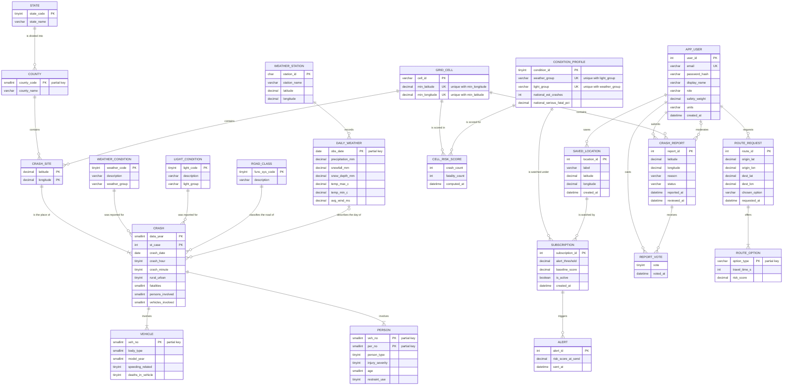

# ER Diagram: Traffic Safety Risk Analyzer (Team ReSQL)

```mermaid
erDiagram
  STATE ||--o{ COUNTY : "is divided into"
  COUNTY ||--o{ CRASH_SITE : "contains"
  CRASH_SITE ||--|{ CRASH : "is the place of"
  WEATHER_CONDITION ||--o{ CRASH : "was reported for"
  LIGHT_CONDITION ||--o{ CRASH : "was reported for"
  ROAD_CLASS ||--o{ CRASH : "classifies the road of"
  CRASH ||--|{ VEHICLE : involves
  CRASH ||--|{ PERSON : involves
  GRID_CELL ||--o{ CRASH_SITE : "contains"
  DAILY_WEATHER |o--o{ CRASH : "describes the day of"
  WEATHER_STATION ||--o{ DAILY_WEATHER : records
  GRID_CELL ||--o{ CELL_RISK_SCORE : "is scored in"
  CONDITION_PROFILE ||--o{ CELL_RISK_SCORE : "is scored for"
  CONDITION_PROFILE ||--o{ SUBSCRIPTION : "is watched under"
  APP_USER ||--o{ SAVED_LOCATION : saves
  APP_USER ||--o{ CRASH_REPORT : submits
  APP_USER ||--o{ REPORT_VOTE : casts
  CRASH_REPORT ||--o{ REPORT_VOTE : receives
  GRID_CELL ||--o{ CRASH_REPORT : "contains"
  APP_USER ||--o{ ROUTE_REQUEST : requests
  APP_USER |o--o{ CRASH_REPORT : moderates
  SAVED_LOCATION ||--o{ SUBSCRIPTION : "is watched by"
  SUBSCRIPTION ||--o{ ALERT : triggers
  ROUTE_REQUEST ||--|{ ROUTE_OPTION : offers

  STATE {
    tinyint state_code PK
    varchar state_name
  }
  COUNTY {
    smallint county_code PK "partial key"
    varchar county_name
  }
  WEATHER_CONDITION {
    tinyint weather_code PK
    varchar description
    varchar weather_group
  }
  LIGHT_CONDITION {
    tinyint light_code PK
    varchar description
    varchar light_group
  }
  ROAD_CLASS {
    tinyint func_sys_code PK
    varchar description
  }
  CRASH_SITE {
    decimal latitude PK
    decimal longitude PK
  }
  CRASH {
    smallint data_year PK
    int st_case PK
    date crash_date
    tinyint crash_hour
    tinyint crash_minute
    tinyint rural_urban
    smallint fatalities
    smallint persons_involved
    smallint vehicles_involved
  }
  VEHICLE {
    smallint veh_no PK "partial key"
    smallint body_type
    smallint model_year
    tinyint speeding_related
    tinyint deaths_in_vehicle
  }
  PERSON {
    smallint veh_no PK "partial key"
    smallint per_no PK "partial key"
    tinyint person_type
    tinyint injury_severity
    smallint age
    tinyint restraint_use
  }
  GRID_CELL {
    varchar cell_id PK
    decimal min_latitude UK "unique with min_longitude"
    decimal min_longitude UK "unique with min_latitude"
  }
  WEATHER_STATION {
    char station_id PK
    varchar station_name
    decimal latitude
    decimal longitude
  }
  DAILY_WEATHER {
    date obs_date PK "partial key"
    decimal precipitation_mm
    decimal snowfall_mm
    decimal snow_depth_mm
    decimal temp_max_c
    decimal temp_min_c
    decimal avg_wind_ms
  }
  CONDITION_PROFILE {
    tinyint condition_id PK
    varchar weather_group UK "unique with light_group"
    varchar light_group UK "unique with weather_group"
    int national_est_crashes
    decimal national_serious_fatal_pct
  }
  CELL_RISK_SCORE {
    int crash_count
    int fatality_count
    datetime computed_at
  }
  APP_USER {
    int user_id PK
    varchar email UK
    varchar password_hash
    varchar display_name
    varchar role
    decimal safety_weight
    varchar units
    datetime created_at
  }
  SAVED_LOCATION {
    int location_id PK
    varchar label
    decimal latitude
    decimal longitude
    datetime created_at
  }
  CRASH_REPORT {
    int report_id PK
    decimal latitude
    decimal longitude
    varchar reason
    varchar status
    datetime reported_at
    datetime reviewed_at
  }
  REPORT_VOTE {
    tinyint vote
    datetime voted_at
  }
  SUBSCRIPTION {
    int subscription_id PK
    decimal alert_threshold
    decimal baseline_score
    boolean is_active
    datetime created_at
  }
  ALERT {
    int alert_id PK
    decimal risk_score_at_send
    datetime sent_at
  }
  ROUTE_REQUEST {
    int route_id PK
    decimal origin_lat
    decimal origin_lon
    decimal dest_lat
    decimal dest_lon
    varchar chosen_option
    datetime requested_at
  }
  ROUTE_OPTION {
    varchar option_type PK "partial key"
    int travel_time_s
    decimal risk_score
  }
```
